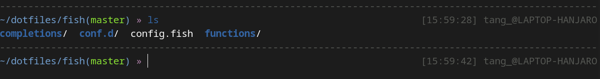

# af-magic-fish
af-magic theme for fish

based on [tbjgolden/af-magic](https://gist.github.com/tbjgolden/888d9a8b0eadf38d79ecbe1eafda1e7e#file-fish_prompt-fish)


## How to use

+ without omf: copy fish_prompt.fish and fish_right_prompt.fish to your function/ folder
+ with omf:
```fish
omf cd
cd themes
git clone (this repo)
omf theme af-magic-fish
```
